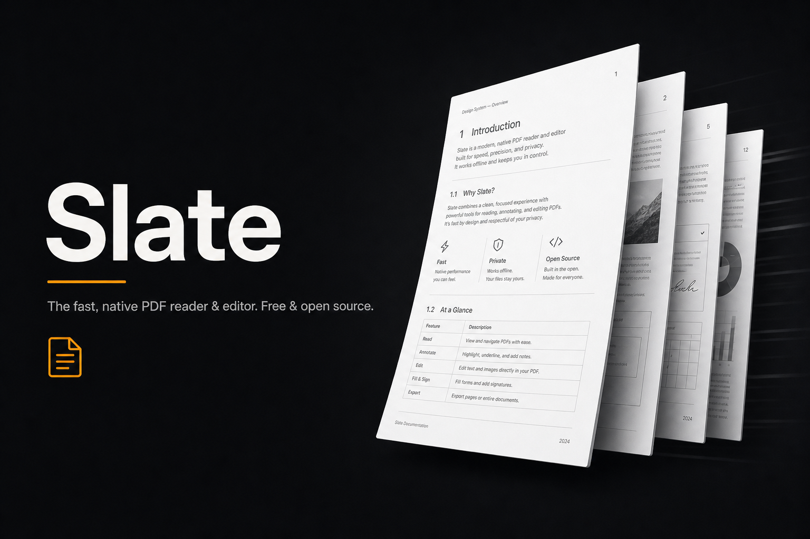
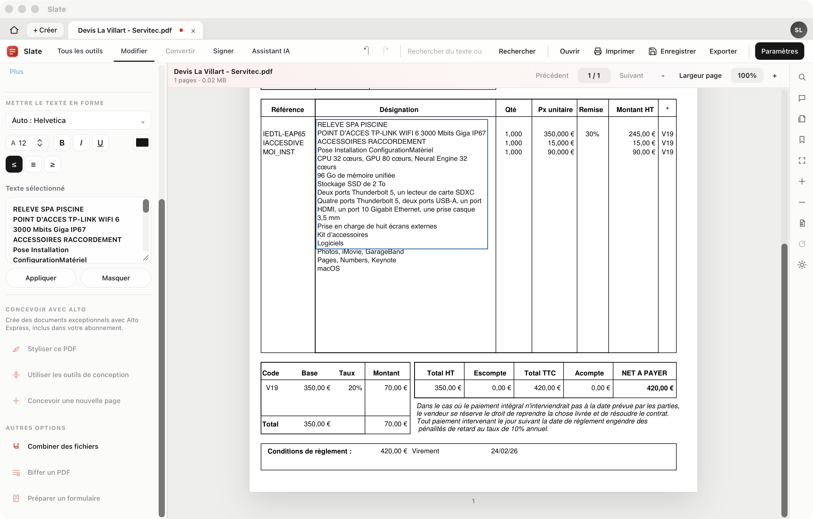
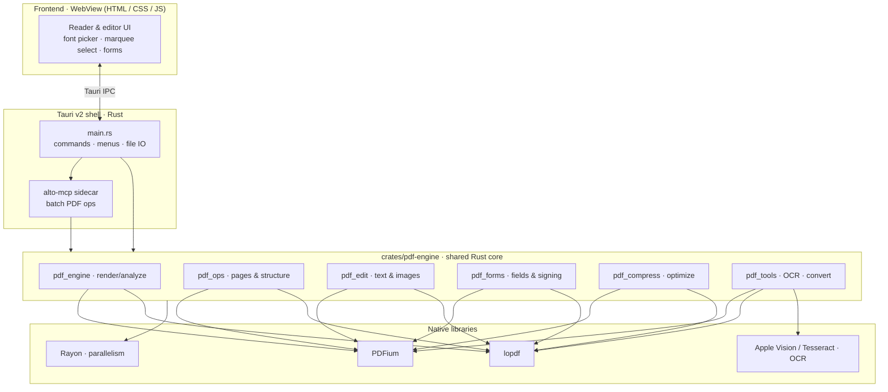

<div align="center">



# Slate

**A fast, native, privacy-first PDF reader & editor — free and open source.**

Read, annotate, edit text and images, fill & sign forms, run OCR, compress,
convert and export PDFs. No cloud, no account, no telemetry. Your files never
leave your machine.

[](LICENSE)
[](#-download)
[](#-architecture)
[](#-roadmap)

[**Download**](#-download) · [**Features**](#-features) · [**Architecture**](#-architecture) · [**Build from source**](#-build-from-source) · [**Roadmap**](#-roadmap)

</div>

---

## ✨ Why Slate

Most PDF editors are either heavyweight cloud suites that upload your documents,
or slow Electron apps wrapping a JavaScript renderer. Slate is different:

- **Native & fast.** A Rust core driving [PDFium](https://pdfium.googlesource.com/pdfium/)
  and [`lopdf`](https://github.com/J-F-Liu/lopdf), wrapped in a thin
  [Tauri v2](https://v2.tauri.app/) shell. CPU-bound work is parallelized with
  [Rayon](https://github.com/rayon-rs/rayon).
- **Private by design.** Everything runs locally. No account, no server round
  trips, no analytics. OCR uses Apple Vision on macOS (Tesseract fallback).
- **Genuinely free.** Licensed under the **GNU AGPL-3.0** — free to use, study,
  modify and share, and it stays that way.
- **Polished.** A clean, Apple/Acrobat-grade interface focused on the document,
  not the chrome.

<div align="center">



<sub>Slate in edit mode: per-character text formatting, full system + web font picker, and live in-place editing.</sub>

</div>

---

## ⬇️ Download

| Platform | Architecture | Status | Link |
| --- | --- | --- | --- |
| **macOS** | Apple Silicon (aarch64) | ✅ Signed & notarized | [**Download `.dmg`**](https://github.com/Soflution1/Slate/releases/latest) |
| **macOS** | Intel (x86_64) | 🛠 Build from source | [Instructions](#-build-from-source) |
| **Windows** | x86_64 | 🔄 Via CI | [Releases](https://github.com/Soflution1/Slate/releases) |
| **Linux** | x86_64 | 🔄 Via CI | [Releases](https://github.com/Soflution1/Slate/releases) |

> **macOS:** download the `.dmg`, open it, and drag **Slate** to *Applications*.
> The build is signed with a Developer ID and notarized by Apple, so it launches
> without security warnings.

➡️ **Latest release:** [github.com/Soflution1/Slate/releases/latest](https://github.com/Soflution1/Slate/releases/latest)

---

## 🚀 Features

### Read & navigate
- Smooth, GPU-accelerated rendering of large documents
- Continuous and single-page layouts, fit-to-width, zoom, rotation
- Full-text search, page thumbnails, bookmarks and outline navigation
- Remembers where you left off, per document

### Edit
- **In-place text editing** directly on the page — type, delete, rewrite
- **Per-character formatting:** font family, size, color, bold, italic, underline
- **Font picker** with all installed system fonts **+** a curated catalog of
  ~250 online fonts, searchable
- **Clean multi-line paste** — pasted text keeps proper line spacing instead of
  inheriting the source's foreign styling, and replaces the selected text
- **Rubber-band (marquee) multi-selection:** drag a selection rectangle to grab
  multiple blocks (highlighted progressively as you drag), then move or delete
  them together
- Move, resize and delete text blocks and images; alignment guides
- Insert, reorder, rotate, duplicate and delete pages; combine multiple files

### Forms & signatures
- Fill interactive PDF form fields
- Draw, type or place a signature anywhere on the document
- Prepare new form fields

### Tools
- **OCR:** add a searchable text layer (Apple Vision on macOS, Tesseract fallback)
- **Compress** to shrink file size while preserving quality
- **Convert** between formats
- **Redact** sensitive content
- **AI assistant** for document-aware actions (bring your own model/key)
- **Export** edited PDFs, single pages, or flattened copies

### Privacy & platform
- 100% local processing — no uploads, no telemetry
- Signed & notarized macOS builds; cross-platform via Tauri

---

## 🏗 Architecture

Slate is a thin native shell over a shared Rust PDF engine. The same engine
crate is designed to power both the desktop app and a future WebAssembly build
for the browser.



**Key idea — one engine, two targets.** The PDF logic lives in
`crates/pdf-engine` so the desktop binary and a planned `wasm` build can share
the exact same behavior. The frontend talks to whichever transport is available
(native Tauri IPC today, a WASM worker in the browser tomorrow).

> A reliability note baked into the build: `build.rs` fingerprints
> `frontend-dist`, so the binary is always recompiled when the UI changes and
> never ships stale embedded assets.

---

## 🧰 Tech stack

| Layer | Technology |
| --- | --- |
| Shell | [Tauri v2](https://v2.tauri.app/) (Rust + WebKit / WebView2 / WebKitGTK) |
| PDF rendering | [PDFium](https://pdfium.googlesource.com/pdfium/) via [`pdfium-render`](https://github.com/ajrcarey/pdfium-render) |
| PDF structure | [`lopdf`](https://github.com/J-F-Liu/lopdf) |
| Parallelism | [Rayon](https://github.com/rayon-rs/rayon) |
| OCR | Apple Vision (macOS) · [Tesseract](https://github.com/tesseract-ocr/tesseract) (fallback) |
| Frontend | Vanilla HTML / CSS / JS (no framework, instant startup) |

---

## 📦 Repository layout

```
Slate/
├── src-tauri/                  Rust shell + Tauri commands
│   ├── src/main.rs             App entry · commands · menus
│   ├── src/bin/alto_mcp.rs     Sidecar for batch PDF ops
│   ├── frontend-dist/          UI (HTML / CSS / JS), embedded at build time
│   └── build.rs                Frontend fingerprint → always-fresh assets
├── crates/
│   └── pdf-engine/             Shared PDF engine (desktop + WASM-ready)
│       └── src/{pdf_engine,pdf_ops,pdf_edit,pdf_forms,pdf_compress,pdf_tools}.rs
├── .github/workflows/          Cross-platform release builds
├── LICENSE                     GNU AGPL-3.0
└── NOTICE                      Copyright & attribution
```

> PDFium native libraries (`libpdfium.*`) are **not** committed — they are
> fetched per-OS by CI and kept locally for development.

---

## 🛠 Build from source

### Prerequisites
- [Rust](https://rustup.rs/) (stable)
- [Tauri CLI](https://v2.tauri.app/start/): `cargo install tauri-cli --version "^2"`
- macOS: Xcode command line tools · Windows: WebView2 · Linux: WebKitGTK + `libfontconfig1-dev` `libfreetype6-dev`
- A PDFium shared library placed in `src-tauri/` (e.g. `libpdfium.dylib` on macOS),
  or pointed to via the `ALTO_PDFIUM_DIR` environment variable

### Build

```bash
git clone https://github.com/Soflution1/Slate.git
cd Slate

# Development build
cargo tauri build --debug

# Release build (signed on macOS if a Developer ID is configured)
cargo tauri build
# → src-tauri/target/release/bundle/macos/Slate.app
# → src-tauri/target/release/bundle/dmg/Slate_<version>_aarch64.dmg
```

Cross-platform release builds (macOS · Windows · Linux) are produced
automatically by GitHub Actions on tagged releases.

---

## 🗺 Roadmap

- [x] Standalone native PDF reader & editor
- [x] Per-character text formatting + full font catalog
- [x] Marquee multi-selection (progressive) & block deletion
- [x] Clean multi-line paste that replaces the selection
- [x] Shared `pdf-engine` crate (desktop + WASM-ready)
- [ ] WebAssembly engine + browser build (Chrome / Firefox / Safari)
- [ ] Windows & Linux signed releases
- [ ] In-browser OCR (tesseract.js), signing & LLM features

---

## 🤝 Contributing

Issues and pull requests are welcome. Parts of the engine are derived from
ONLYOFFICE under the AGPL; any derived module must keep its source attribution
and AGPL header — see [`NOTICE`](NOTICE).

---

## 📄 License

**GNU Affero General Public License v3.0 or later** — see [LICENSE](LICENSE).

© 2026 Soflution LTD.

Portions of the engine are derived from
[ONLYOFFICE](https://github.com/ONLYOFFICE), copyright **Ascensio System SIA**,
distributed under the AGPL-3.0. Derived Rust modules retain explicit source
references and AGPL notices. ONLYOFFICE trademarks, logos and branded assets are
**not** part of this project and are not used as Slate branding.

<div align="center">
<sub>Built with Rust 🦀 · Free forever · Made in Europe</sub>
</div>
